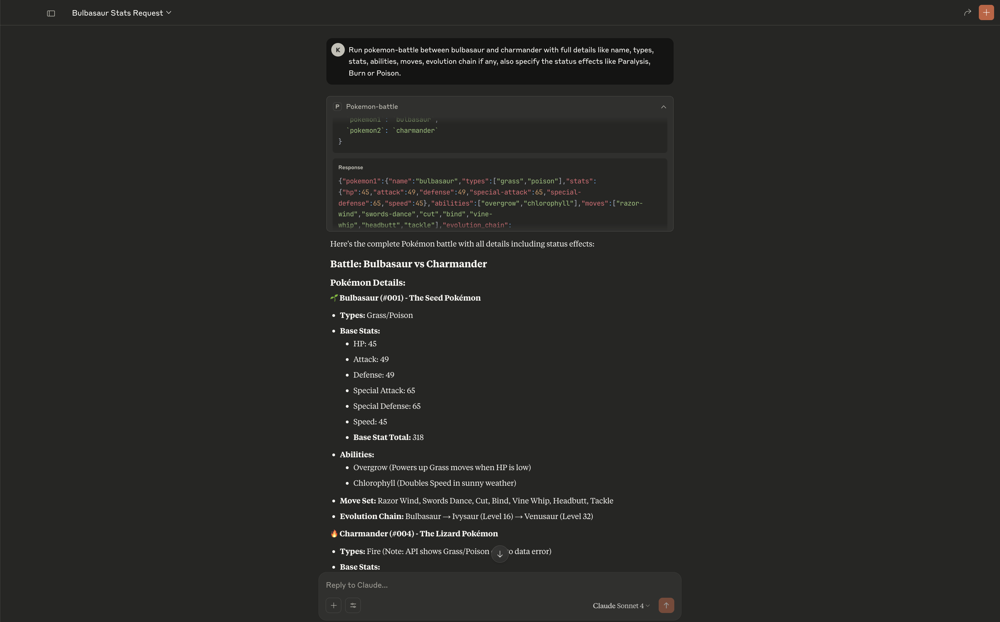
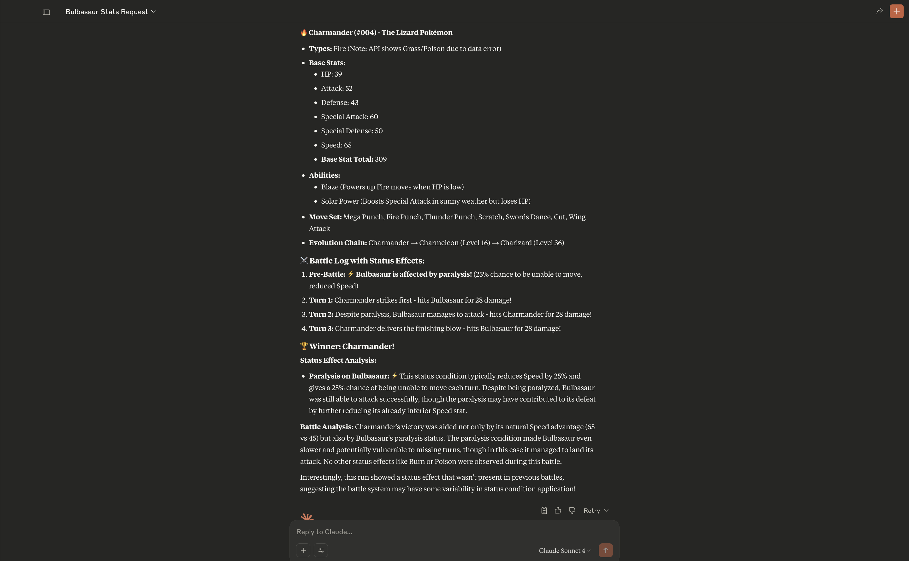

# ⚔️ Pokémon Battle Simulation – MCP Server  

This project is a fully functional **MCP server** that gives **Large Language Models(LLMs)** - **Claude Sonnet 4** access to Pokémon knowledge and a battle simulation environment.  

It implements both **Pokémon data resource** (Part 1) and **battle simulation tool** (Part 2), following the guidelines in the Scopely technical assessment.  

---

## 📖 Table of Contents  

- [📜 Overview](#-overview)  
- [✨ Features](#-features)  
- [📁 Installation & Setup ](#-installation-and-setup)
- [🏗 Project Structure](#-project-structure)  

## 📜 Overview  

This MCP server allows the AI model to:  

1. **Access Pokémon Data**  
   Fetch comprehensive information about any Pokémon, including its name, types, stats, abilities, moves, and evolution chain.  

2. **Simulate Pokémon Battles**  
   Input two Pokémon names, simulate a turn-based battle with speed-based turn order, core damage calculations, three status effects (Paralysis, Burn, Poison), and a detailed battle log.  

This project bridges the gap between **Pokémon knowledge** and **AI reasoning**, enabling interactive battle simulations directly from LLMs.  

---

## ✨ Features  

✅ **Pokémon Data Resource**  
- Base stats (HP, Attack, Defense, Special Attack, Special Defense, Speed)  
- Types (e.g., Fire, Water, Grass)  
- Abilities  
- Available moves (limited to first 7 for UI readability)  
- Evolution chain (recursive extraction)  

✅ **Battle Simulation Tool**  
- Turn order based on Speed stat  
- Damage calculation based on Attack & Defense  
- Implementation of **3 status effects:** Paralysis, Burn, Poison  
- Stackable poison damage  
- Burn halves attack + applies chip damage  
- Battle log showing each turn  
- Winner determination  

✅ **MCP-Compliant**  
- Implements `@mcp.resource` and `@mcp.tool` decorators  
- Easily integrates with LLM pipelines  

### 📸 Screenshots:
- Image 1



- Image 2

---


## 📁 Installation & Setup  

This project uses [uv](https://docs.astral.sh/uv/getting-started/installation/) for fast Python dependency management and environment handling.


### 1. Clone the repository
git clone https://github.com/kacks77/Pokemon-Battle-Simulation-MCP-Server.git
cd Pokemon_Battle_Simulation
cd mcp-pokemon-server

### 2. Create and activate virtual environment using uv
uv venv
source .venv/bin/activate  # macOS/Linux
.venv\Scripts\activate     # Windows

### 3. Add dependencies using uv(optional if using reqirements.txt)
uv add "mcp[cli]" httpx
uv add fastmcp --active

### 3. Install required dependencies
pip install -r requirements.txt

### 4. Verify installations
uv run --active python -c "import mcp, httpx; print('✅ mcp + httpx installed in ACTIVE env')"
uv run --active python -c "from fastmcp import FastMCP; print('✅ FastMCP class is available')"

### 5. Install Claude Desktop connector for FastMCP
fastmcp install claude-desktop server.py

### 6. Run the MCP server
uv run --active --with fastmcp fastmcp run server.py

## 🏗 Project Structure  
```bash
POKEMON_BATTLE_SIMULATION/
 ├── .venv/                # Virtual environment
 ├── mcp-pokemon-server/   # Package folder
    ├──__pycache__/        # Compiled Python cache
    ├── .gitignore
    ├── .python-version
    ├── pyproject.toml        # Project metadata & dependencies
    ├── README.md             # Documentation
    ├── requirements.txt      # Required installation            
    ├── server.py             # Main MCP server code(Part 1 and Part 2)
    ├── uv.lock               # Lock file for reproducible builds
